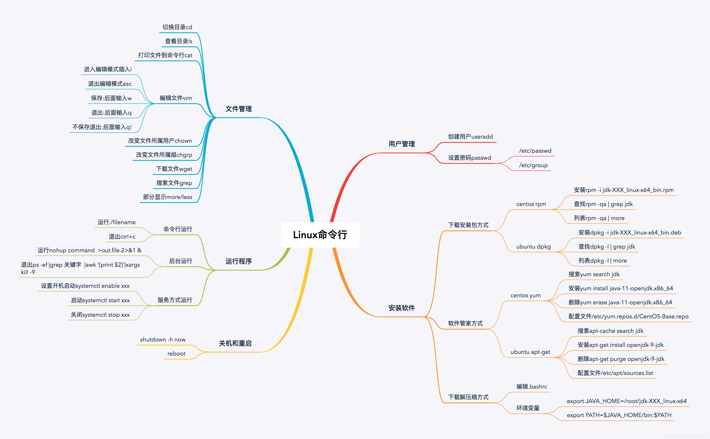

# Linux必须掌握的命令

### 0. 思维导图




这是Linux运维中最核心、最常用的一组命令的详细用法说明。我将为每个命令提供语法、常用选项和实例，让你能快速上手。

------

### 1. `ls` - 列出目录内容

**功能：** 显示指定目录下的文件和子目录。

**常用语法：** `ls [选项] [文件或目录...]`

**常用选项：**

- `-l`：以长格式显示，包含详细信息（权限、所有者、大小、修改时间）。
- `-a`：显示所有文件，包括隐藏文件（以 `.` 开头的文件）。
- `-h`：与 `-l` 一起使用，以人类可读的格式显示文件大小（如 K, M, G）。
- `-t`：按修改时间排序，最新的在最前面。
- `-r`：反向排序。
- `-R`：递归列出所有子目录中的内容。

**实例：**

bash

```
ls          # 列出当前目录内容（不包含隐藏文件）
ls -l       # 长格式列表
ls -la      # 长格式列表，包含隐藏文件
ls -lh      # 长格式列表，文件大小易读
ls /etc     # 列出 /etc 目录的内容
ls -lht     # 长格式，易读，按时间排序（最新在上）
```


------

### 2. `cd` - 切换目录

**功能：** 改变当前工作目录。

**常用语法：** `cd [目录路径]`

**特殊符号：**

- `cd` 或 `cd ~`：切换到当前用户的家目录（如 `/home/username`）。
- `cd -`：切换到上一次所在的目录。
- `cd ..`：切换到上一级目录。

**实例：**

bash

```
cd /usr/local     # 切换到 /usr/local 目录
cd ..             # 切换到上级目录
cd ../etc         # 切换到当前目录的上级目录下的 etc 目录
cd ~              # 回家目录
cd -              # 返回上一个所在的目录（比如从 /tmp 跳回 ~）
```


------

### 3. `cp` - 复制文件或目录

**功能：** 复制文件或目录。

**常用语法：** `cp [选项] 源文件 目标文件` 或 `cp [选项] 源文件... 目标目录`

**常用选项：**

- `-r` 或 `-R`：递归复制，用于复制目录。
- `-i`：覆盖前提示确认。
- `-p`：保留原始文件的属性（如修改时间、权限）。
- `-v`：显示复制过程的详细信息。

**实例：**

bash

```
cp file1.txt file2.txt          # 将 file1.txt 复制为 file2.txt
cp file1.txt /tmp/              # 将 file1.txt 复制到 /tmp 目录下
cp -r dir1/ dir2/               # 递归复制 dir1 目录到 dir2（如果 dir2 不存在则创建）
cp -i *.txt /backup/            # 复制所有 .txt 文件到 /backup，覆盖前询问
cp -p important.conf /backup/   # 复制并保留原文件属性
```


------

### 4. `mv` - 移动或重命名文件/目录

**功能：** 移动文件或目录，也可用于重命名。

**常用语法：** `mv [选项] 源文件 目标文件` 或 `mv [选项] 源文件... 目标目录`

**常用选项：**

- `-i`：覆盖前提示确认。
- `-v`：显示移动过程的详细信息。

**实例：**

bash

```
mv oldname.txt newname.txt      # 重命名文件
mv file1.txt /tmp/              # 将 file1.txt 移动到 /tmp 目录
mv dir1/ /new/location/         # 移动目录（不需要 -r 选项）
mv -i *.log /archive/           # 移动所有 .log 文件，覆盖前询问
```


------

### 5. `rm` - 删除文件或目录

**功能：** 删除文件或目录。**（警告：此命令删除后一般无法恢复！）**

**常用语法：** `rm [选项] 文件或目录...`

**常用选项：**

- `-r` 或 `-R`：递归删除，用于删除目录及其内容。
- `-f`：强制删除，不提示任何信息。
- `-i`：删除前逐一询问确认。

**⚠️ 危险警告：`rm -rf /` 或 `rm -rf /\*` 会强制删除根目录下的所有文件，导致系统瘫痪，绝对不要执行！**

**实例：**

bash

```
rm file.txt                     # 删除文件
rm -r old_dir/                  # 递归删除目录 old_dir
rm -i *.tmp                     # 交互式删除所有 .tmp 文件，每个都询问
rm -rf /data/temp/*             # 强制删除 /data/temp 下的所有内容（慎用！）
```


------

### 6. `mkdir` - 创建目录

**功能：** 创建新目录。

**常用语法：** `mkdir [选项] 目录名...`

**常用选项：**

- `-p`：递归创建目录，如果父目录不存在则一并创建。

**实例：**

bash

```
mkdir new_folder                # 创建名为 new_folder 的目录
mkdir -p project/{src,log,bin} # 一次性创建 project 目录及其下的 src, log, bin 子目录
mkdir -p /a/long/path           # 创建一串不存在的目录
```


------

### 7. `find` - 查找文件

**功能：** 在目录树中递归查找文件，功能极其强大。

**常用语法：** `find [路径...] [表达式]`

**常用表达式：**

- `-name "模式"`：按文件名查找（支持通配符 `*` `?`）。
- `-type 类型`：按文件类型查找（`f`-普通文件，`d`-目录）。
- `-mtime +/-n`：按修改时间查找（`+7`表示7天前，`-7`表示7天内）。
- `-exec 命令 {} \;`：对找到的文件执行指定的命令。

**实例：**

bash

```
find /home -name "*.txt"        # 在 /home 下查找所有 .txt 文件
find . -type f -name "*.conf"   # 在当前目录下查找所有 .conf 文件
find /var/log -mtime -1         # 查找 /var/log 下一天内修改过的文件
find /tmp -type f -size +10M    # 查找 /tmp 下大于10MB的文件
find . -name "*.old" -exec rm -f {} \;  # 找到所有 .old 文件并删除
```


------

### 8. `grep` - 文本搜索

**功能：** 在文件中搜索匹配指定模式（正则表达式）的行。

**常用语法：** `grep [选项] "模式" [文件...]`

**常用选项：**

- `-i`：忽略大小写。
- `-r` 或 `-R`：递归搜索子目录。
- `-n`：显示匹配行的行号。
- `-v`：反向选择，显示不包含模式的行。
- `-l`：只显示包含模式的文件名。
- `-E`：使用扩展正则表达式（等同于 `egrep`）。

**实例：**

bash

```
grep "error" /var/log/syslog    # 在 syslog 中查找包含 "error" 的行
grep -r "TODO" /project/src/    # 递归在 /project/src 中搜索 "TODO"
grep -n "root" /etc/passwd      # 在 passwd 中找 "root" 并显示行号
ps aux | grep nginx             # 结合管道，查找 nginx 进程
grep -E "^[0-9]{3}-[0-9]{4}" file.txt # 使用扩展正则匹配电话号码模式
```


------

### 9. `awk` - 文本处理语言

**功能：** 强大的文本分析和处理工具，尤其适合处理结构化文本（如日志、CSV）。

**基本语法：** `awk '模式 {动作}' 文件`

**内置变量：** `$0`（整行），`$1`, `$2`, ...（第1，2...列），`NF`（列数），`NR`（当前行号）。

**实例：**

bash

```
awk '{print $1}' file.txt       # 打印每行的第一列（默认以空格/tab分隔）
awk -F':' '{print $1, $7}' /etc/passwd  # 指定冒号为分隔符，打印用户名和shell
awk '$3 > 1000 {print $1}' /etc/passwd # 如果第三列大于1000，打印第一列
ps aux | awk '{mem += $4} END {print mem}' # 计算所有进程内存占用百分比的总和
```


------

### 10. `sed` - 流编辑器

**功能：** 用于对文本进行过滤和转换（如替换、删除、插入）。

**常用语法：** `sed [选项] '命令' 文件`

**常用命令：**

- `s/原字符串/新字符串/g`：替换（`g` 表示全局替换）。
- `d`：删除行。
- `p`：打印行。

**常用选项：**

- `-i`：直接修改文件内容（原地编辑），**慎用，最好先不加 -i 测试**。
- `-e`：指定多个编辑命令。

**实例：**

bash

```
sed 's/foo/bar/g' file.txt      # 将文件中所有的 foo 替换为 bar（只输出到屏幕）
sed -i 's/old/new/g' file.conf  # 直接修改文件，将 old 替换为 new
sed '2,5d' file.txt             # 删除第2到第5行
sed -n '10,20p' file.txt        # 只打印文件的第10到20行（-n 抑制默认输出）
sed -e 's/foo/bar/' -e '/^#/d' file.txt # 先替换，再删除所有以 # 开头的行
```


------

### 11. `tar` - 打包和解包文件

**功能：** 将多个文件或目录打包成一个归档文件，常与压缩工具结合。

**常用语法：** `tar [选项] 归档文件名 [文件或目录...]`

**常用选项：**

- **创建归档：** `-c`
- **查看归档：** `-t`
- **解压归档：** `-x`
- **指定文件名：** `-f` （后面必须紧跟文件名）
- **压缩/解压：**
  - `-z`：使用 gzip 压缩/解压（`.tar.gz` 或 `.tgz`）。
  - `-j`：使用 bzip2 压缩/解压（`.tar.bz2`）。
  - `-J`：使用 xz 压缩/解压（`.tar.xz`）。

**实例：**

bash

```
# 打包压缩
tar -czvf project.tar.gz /path/to/project/  # 创建 gzip 压缩包（c-创建，z-gzip，v-显示过程，f-指定文件名）
tar -cjvf backup.tar.bz2 dir1/ dir2/        # 创建 bzip2 压缩包

# 查看
tar -tzvf project.tar.gz                    # 查看压缩包内容（t-列表）

# 解压
tar -xzvf project.tar.gz                    # 解压到当前目录（x-解压）
tar -xzvf project.tar.gz -C /target/path    # 解压到指定目录（-C 改变目录）
```


------

### 12. `ssh` - 安全远程登录

**功能：** 通过加密的连接远程登录到另一台Linux服务器。

**常用语法：** `ssh [选项] [用户名@]主机名或IP [命令]`

**常用选项：**

- `-p 端口号`：指定远程主机的SSH端口（默认为22）。
- `-i 私钥文件`：指定用于认证的私钥文件。

**实例：**

bash

```
ssh user@192.168.1.100          # 以 user 用户登录到 192.168.1.100
ssh root@server.example.com     # 以 root 用户登录到 server.example.com
ssh -p 2222 user@hostname       # 连接到主机的 2222 端口
ssh user@hostname 'ls -l /tmp'  # 登录后执行 `ls -l /tmp` 命令并退出
# 使用密钥对登录（更安全，需提前配置）
ssh -i ~/.ssh/my_key.pem ubuntu@ec2-xx-xx-xx-xx.compute-1.amazonaws.com
```


------

### 学习建议

1. **不要死记硬背**：理解每个命令的用途，多用就熟了。
2. **善用帮助**：忘记选项时，使用 `man 命令名`（如 `man ls`）或 `命令名 --help` 查看详细手册。
3. **组合使用**：通过管道 `|` 将命令组合起来是Linux的强大之处（如 `ps aux | grep nginx | awk '{print $2}'`）。

希望这份详细的总结对你有帮助！
